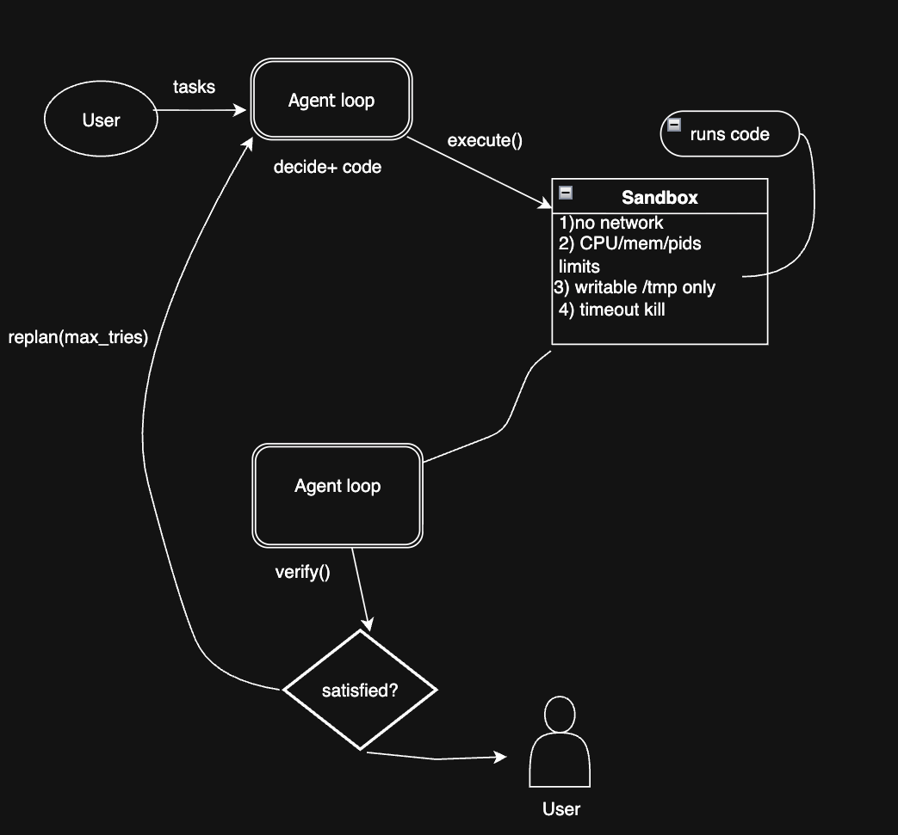

# sandloop

A sandboxed code-execution agent, built from scratch to learn agent architecture
and container isolation. An LLM writes code; the code runs inside a throwaway
Docker container instead of on the host.

This is a hand-built miniature of what E2B, Modal Sandboxes and Code Interpreter
run in production.

## Architecture



## Status

| Phase | Scope | State |
|-------|-------|-------|
| 1 | Docker runner — execute code, capture output, guarantee teardown | **done** |
| 2 | Isolation hardening — no network, cgroup limits, read-only rootfs, non-root | **done** |
| 3 | Agent loop — LLM calls the sandbox as a tool | **half** — loop done, provider adapter next |
| 4 | File I/O — a persistent per-session workspace | |
| 5 | Concurrency and a reaper for stale containers | |
| 6 | Adversarial testing — fork bombs, memory hogs, egress attempts | |

## Quickstart

```bash
python -m venv .venv && source .venv/bin/activate
pip install -r requirements-dev.txt
```

Run a file, or pipe from stdin:

```bash
python sandbox.py examples/hello.py
echo 'print(6 * 7)' | python sandbox.py
python sandbox.py -l node -t 10 script.js
```

From Python:

```python
from sandbox import run_code

result = run_code('print("hi")')
print(result.stdout, result.exit_code, result.ok)
```

## The contract

`run_code(code, language="python", timeout_seconds=30) -> ExecutionResult`

| Field | Meaning |
|-------|---------|
| `stdout` / `stderr` | captured separately, never interleaved |
| `exit_code` | the process exit code; `-1` when killed by timeout |
| `duration_seconds` | wall clock, measured around the whole run |
| `timed_out` | `True` if the container was killed rather than exiting |
| `ok` | `exit_code == 0 and not timed_out` |

Two rules the rest of the system depends on:

**Code failing is a result, not an exception.** A syntax error, a non-zero exit
or a timeout all come back as a populated `ExecutionResult`. Only the sandbox
itself failing — no Docker daemon, unpullable image — raises `SandboxError`.
Phase 3's agent loop needs to feed failures back to the model, so they must be
data rather than control flow.

**Teardown always happens.** The container is force-removed and the staging
directory deleted in a `finally`, including on timeout and on Docker errors.
Cleanup is best-effort and never raises, so it cannot mask the original failure.
Two tests assert no container and no temp directory survives a run.

## Isolation

Every execution runs under `SandboxLimits`, verified from inside the container
by reading its own cgroup files:

| Control | Setting | Effect |
|---------|---------|--------|
| `network_mode` | `none` | no sockets, no DNS |
| `mem_limit` / `memswap_limit` | `256m` / `256m` | OOM-killed at the ceiling, no swap headroom |
| `nano_cpus` | `0.5` CPU | `cpu.max` = `50000 100000` |
| `pids_limit` | `64` | a fork bomb stops at 63 children |
| `read_only` | `True` | the image cannot be modified |
| `tmpfs` | `/tmp`, 64 MB, `mode=1777` | scratch space that cannot fill the host disk |
| `user` | `65534:65534` | not root |

Overriding them is explicit:

```python
run_code(code, limits=SandboxLimits(network=True, memory="1g"))
```

Two bounds live outside the container because the kernel cannot enforce them
for us: the wall-clock timeout, which kills a container that never exits, and
the 64 KB cap on captured output, which stops a runaway `print` from
exhausting *this* process's memory while decoding logs.

One detail worth knowing if you port this to Linux: `mkdtemp` creates the
staging directory `0700` owned by the host user, which a non-root container
user cannot traverse. The runner widens it to `0755`/`0644` before mounting.
The mount is read-only, so the extra read bit grants nothing else.

### Still open

An escape through the shared kernel. Docker containers are namespaces and
cgroups, not a security boundary against a determined attacker with a kernel
exploit. Closing that means gVisor or Firecracker, which is a runtime swap
rather than a code change — the scaling step, not a Phase 2 gap.

## The agent loop

`run_agent(task, client, max_iterations=10)` alternates model turns and sandbox
executions until the model answers without asking for a tool, then stops.

It is provider-agnostic on purpose. The loop depends on one protocol:

```python
class LLMClient(Protocol):
    def next_turn(self, transcript: Sequence[Turn]) -> AssistantTurn: ...
```

so nothing in `agent.py` or `sandbox.py` imports a vendor SDK, and the loop is
tested end to end against a scripted client with no API key involved.

Two rules it enforces:

**Bounded.** A model that keeps calling the sandbox stops at `max_iterations`
model turns rather than running until someone notices.

**Nothing raises into the loop.** An unknown tool, a missing argument, an
unsupported language and an unreachable Docker daemon all come back as
`ToolResult(is_error=True)`. The model reads the problem and adjusts — that is
what the loop is for.

### Making failures legible

A sandbox kill is invisible to the model on its own. The kernel terminates the
process, so there is no traceback:

```
exit_code: 137 — killed by the sandbox (SIGKILL): it exceeded the 256m memory
limit. Process less data at a time, or stream instead of building the whole
result in memory.
```

Without that note the model sees a bare `137` and an empty stderr, and retries
the identical allocation. Timeouts, truncated output, and a snippet that ran
but printed nothing are annotated for the same reason.


```bash
pytest tests/ -v
```

58 tests covering output capture, stream separation, exit codes, truncation,
timeout kill, teardown guarantees, and each isolation control above — network
and DNS blocked, OOM kill at the memory ceiling, the fork ceiling, read-only
rootfs, tmpfs size cap and non-persistence, and non-root execution. The
integration tests need a running Docker daemon and skip cleanly without one.
The agent-loop tests are pure unit tests driven by a scripted client, plus two
end-to-end cases that run real code through a real container.
